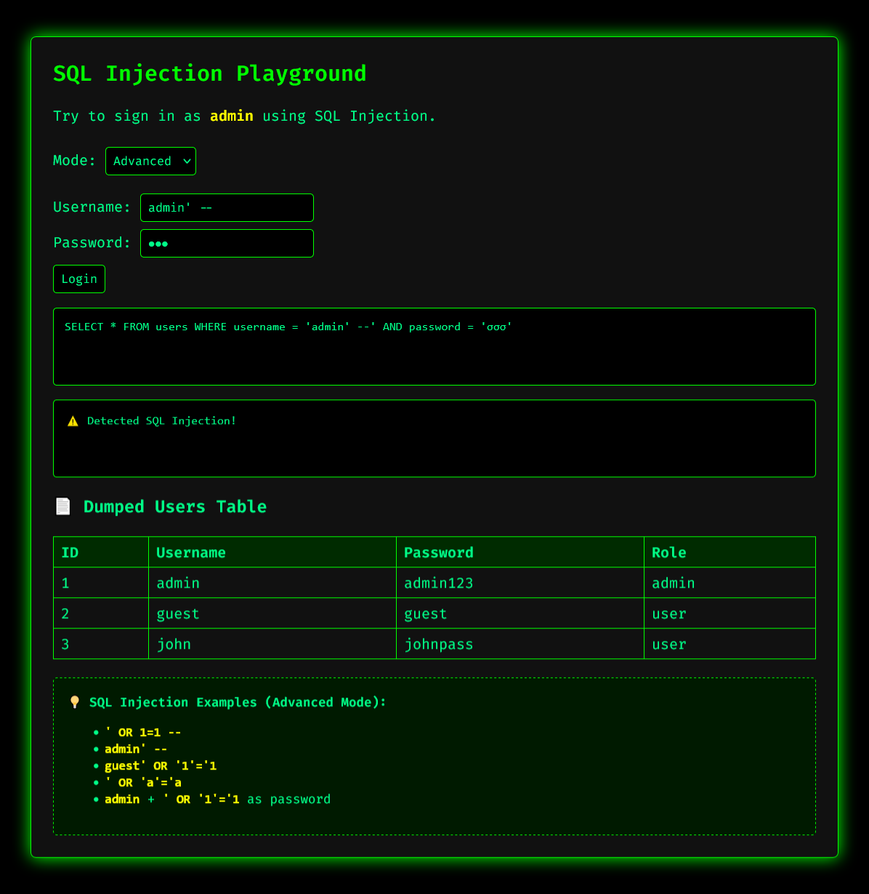

# SQL Injection Playground

**SQL Injection Playground** is an educational web-based tool that demonstrates how SQL injection vulnerabilities can be exploited in poorly secured applications. It provides a safe, simulated environment for learning and testing basic and advanced SQL injection techniques.

## 🔍 Features

- **Beginner Mode** – Accepts only correct username/password (no injection allowed).
- **Advanced Mode** – Simulates vulnerable query logic. Detects SQL injection attempts and dumps a fake users table.
- **Visual SQL Query Output** – Shows the simulated SQL query for each login attempt.
- **Tooltip Examples** – Offers common SQL injection payloads as hints.

## 🛠 Technologies Used

- HTML5 & CSS3 (with custom terminal-style UI)
- JavaScript (vanilla)

## 🚀 How to Use

1. Open `index.html` in any modern browser.
2. Select either **Beginner** or **Advanced** mode.
3. Try entering various usernames and passwords.
4. Use SQL injection payloads (e.g., `' OR 1=1 --`) in **Advanced** mode to trigger the vulnerability and view the dumped data.

## 💡 Sample Payloads (Advanced Mode)

- `' OR 1=1 --`
- `admin' --`
- `guest' OR '1'='1`
- `' OR 'a'='a`
- Username: `admin`  
  Password: `' OR '1'='1`
  
## Screenshots

## ⚠ Disclaimer

This tool is for **educational purposes only**. It does **not connect to a real database** and simulates SQL injection behavior entirely on the frontend. Do **not** use real attack techniques on systems you do not own or have permission to test.

## 📜 License

MIT License – feel free to modify and use for non-commercial educational purposes.

